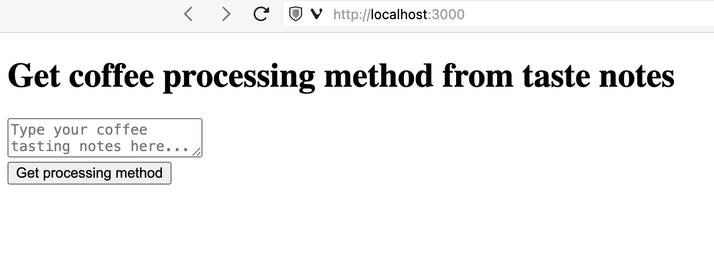

# OpenAI GPT-4o + Okareo + TypeScript example application

This is an example AI application that is built using Next.js, React and Typescript and uses the GPT-4o LLM model for a coffee tasting notes classification task.



## About the app

The app sends a prompt to GPT-4o asking it to assign a set of coffee tasting notes, such as "peach, jasmine, black tea" to a likely coffee processing method, such as "washed" or "natural". The app isn’t designed to be 100% accurate, and a broadly applicable LLM model isn’t necessarily the best tool for this task. However, the results are quite promising.

The key parts of the application code are under:

* `pages/api/generate.tsx` - this is where we call OpenAI’s API.
* `pages/index.tsx` - this is where we generate the app page.

## Running the app locally

We assume that you have Node.js installed, have cloned this repository, and have navigated to the project directory. Now, follow these steps to run the app locally:

1. Install the requirements in the project directory.

   ```bash
   $ npm install
   ```

2. Make a copy of the example environment variables file.

   On Linux systems: 
   ```bash
   $ cp .env.example .env
   ```
   On Windows:
   ```powershell
   $ copy .env.example .env
   ```
3. Add your OpenAI API key to the newly created `.env` file. If you don’t have a key, you can get one at https://platform.openai.com/account/api-keys.

4. Run the app.

   ```bash
   $ npm run dev
   ```

5. Navigate to the URL shown in the `run` command’s output above, by default `http://localhost:3000`.

## Running the tests

The key feature of this repo are the tests created using Jest and [Okareo](https://okareo.com). Okareo is an LLM testing platform that uses synthetic data together with natural-language or code-based scenarios to test LLM and other AI applications.

To run tests in this repository, follow these steps:

1. Add your Okareo API key to the `.env` file you created earlier. If you don’t have an Okareo key or an Okareo account, you can sign up at https://okareo.com and generate an API key inside the application.

2. Run the tests.

   ```bash
   $ npm test
   ```

3. Observe the outcomes of the test suite in your Okareo dashboard.